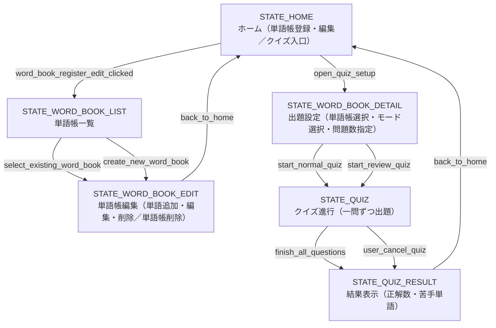

# INTERACTION_FLOW.md

<!--
このファイルでは、ユーザ視点またはシステム視点の「インタラクション状態遷移」を
mermaid の flowchart で記述する (UML 状態マシン図の簡易版)。

目的:
- システムがどのような状態(State)を持ち、どのイベントで状態が変わるかを俯瞰する。
- USE_CASES.md の States 項目から参照される「状態ID」の定義場所とする。

ルール:
- ノードIDは状態IDとして一意に命名する (例: STATE_TITLE, STATE_IN_GAME, STATE_ERROR)。
- 矢印には「イベント名」をできるだけラベルとして明記する。
  - 例: |start_button_clicked|, |login_success|, |timeout|, |sensor_triggered| など。
- ガード条件や細かい例外条件は、必要に応じて [condition] のような簡潔な表記か、
  USE_CASES.md 側の Precondition / ErrorCases に寄せる。
-->

